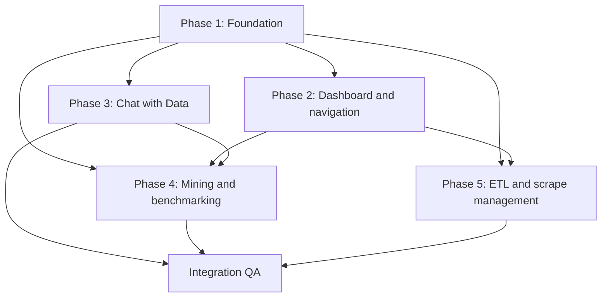

# v3 Dashboard Implementation Plan

This plan converts the gaps in `docs/gap_analysis.md` into dependency-ordered,
testable delivery phases. The Escalation Queue and its keyboard-triage workflow
are explicitly out of scope.

## Delivery principles

- Preserve existing routes and API behavior unless a phase explicitly changes
  their contract.
- Deliver vertical slices that compile and remain usable at the end of every
  phase.
- Keep MongoDB as the source of truth for scraped feedback.
- Recalculate derived engagement metrics immediately before persistence.
- Use semantic design tokens instead of generic colors for sentiment, alert,
  entity-comparison, confidence, and pipeline state.
- Run frontend lint/build and the relevant backend tests after every phase.

## Dependency map

## Phase 1 — Foundation

Status: implemented.

- Dark-first theme with a light-mode toggle.
- v3 sentiment, alert, Hangry Index, confidence, entity-series, and pipeline
  tokens.
- Accessible light-surface foreground companions for sentiment text.
- Noto Sans Myanmar loaded through `next/font/google` and conditionally applied
  to detected Myanmar Unicode content.
- Zustand global filter state for primary entity and date-window selection,
  with comparison selection owned by the radar, benchmark, and Data Mining.
- URL synchronization that preserves route-specific query parameters and keeps
  filters during in-app navigation.
- Sticky filter bar, active-filter breadcrumb, and clear actions.
- TanStack Query provider and the backwards-compatible `useApi` wrapper.
- Shared Select component used by the global filter controls.

Acceptance checks:

- A clean initial URL resets filters to defaults.
- Selecting global filters writes only `entity`, `days`, and optional `aspect`
  parameters.
- Moving between application pages retains active filters.
- Local comparison controls require a primary entity.
- Radar and Data Mining comparisons allow up to two additional entities.
- Burmese Unicode content receives `lang="my"`; English and Burglish retain
  Geist.
- Both themes compile, and semantic text colors meet WCAG AA contrast.

## Phase 2 — Dashboard and navigation

Status: implemented.

- Interactive KPI strip and deep-linked filters.
- Enhanced time-series panel, six-axis ABSA radar, stacked aspect breakdown,
  reaction mix, and top drivers.
- Entity comparison overlays and chart-driven global filtering.
- Sync status surfaces.

Depends on: Phase 1 filters, tokens, and query caching.

Acceptance checks:

- KPI volume, health, and Hangry Index metrics honor entity/date filters and
  link to supporting detail.
- Trend view includes reaction-volume overlay, brush control, and available
  ETL event annotations.
- Radar always uses the six ABSA aspects and supports up to three entity
  series plus raw/volume-weighted modes.
- Aspect bars are stacked, sortable, and update the URL-backed aspect filter.
- Social engagement reports reaction mix and positivity, negativity, and haha
  trends without coercing incomplete breakdowns to zero.
- Top drivers filter recently flagged reviews.
- Header displays pipeline freshness.
- Ask Data AI remains reachable through the floating action button.

## Phase 3 — Chat with Data

Status: implemented.

- Global Chat with Data drawer, keyboard/FAB triggers, streaming responses,
  result visualization, export, pinning, and conversation history.
- Server-enforced read-only SQL.

Depends on: Phase 1 theme/query infrastructure and Phase 2 application shell.

## Phase 4 — Mining and benchmarking

Status: implemented.

- Association-rule network/matrix and cluster scatter visualizations.
- Competitor share-of-voice and aspect benchmarking.
- Minimum-sample guards and review drill-down.

Depends on: Phase 1 global filters and Phase 2 chart interactions.

## Phase 5 — ETL and scrape management

Status: implemented.

- ETL health dialog backed by existing status endpoints.
- Saved entities, scrape wizard, scheduling, cancellation, real-time progress,
  history diagnostics, and server-side concurrency controls.
- Required relational migrations and operational documentation.
- Topbar Scrape Manager drawer with Saved, New, History, and Schedules tabs.
- Three-step source/URL/options wizard with source/name inference.
- Authenticated SSE progress with polling fallback and cooperative cancellation.
- Owner-scoped Supabase RLS, per-target concurrency guard, and local scheduler.

Depends on: Phase 1 query polling and tokens, plus Phase 2 shell status
surfaces.

## Integration QA

- Frontend lint and production build.
- Backend unit and integration tests.
- URL/filter persistence and browser-history checks.
- Dark/light contrast, keyboard navigation, responsive behavior, and Burmese
  rendering checks.
- API authorization, read-only SQL, migration, and failure-state validation.
