# Dogfood Report: Burmese ABSA

| Field | Value |
|-------|-------|
| **Date** | 2026-07-30 |
| **App URL** | http://localhost:3000 |
| **Session** | burmese-absa-e2e |
| **Scope** | Read-only frontend E2E: auth boundary, primary navigation, core pages, console/network failures, accessibility, and responsive behavior |

## Summary

| Severity | Count |
|----------|-------|
| Critical | 1 |
| High | 4 |
| Medium | 3 |
| Low | 1 |
| **Total** | **9** |

## Test Coverage

| Area | Result | Notes |
|------|--------|-------|
| Unauthenticated route guard | pass | `/dashboard` redirects to `/login` |
| Login form modes/validation | pass with accessibility findings | Required-field and invalid-email feedback appear |
| Authenticated dashboard | fail | Two analytics panels fail and masquerade as empty data |
| Entity list and source filters | pass | All/Facebook/Foodpanda filtering works |
| Entity detail | fail | Core route ends in “Failed to fetch” |
| Analytics | fail | Trend/aspect requests fail; remaining charts are unreadably small |
| Scraping setup | pass with content finding | Source switching and settled empty history work; cookie expiry copy is incomplete |
| Chat with Data | fail | Submit control issues no request; developer TODO is visible |
| Alerts | fail | Developer TODO placeholder |
| Data Mining | fail | Developer TODO placeholder |
| Responsive navigation | partial | Mobile menu opens, but page width exceeds viewport |
| Login accessibility | fail | 3 moderate axe-core violations |

## Test Environment

- Authenticated Google Chrome profile at the normal desktop viewport.
- Responsive check at 390 × 844.
- Clean isolated Chromium session for unauthenticated redirects and axe-core 4.12.1.
- Frontend: `http://localhost:3000`; API: `http://localhost:8000`.
- Read-only product testing: no scrape was started, no cookie file was uploaded, no account was created, and the active user was not signed out.

## Issues

### ISSUE-001: Dashboard analytics panels silently fail

| Field | Value |
|-------|-------|
| **Severity** | high |
| **Category** | functional / ux / console |
| **URL** | http://localhost:3000/dashboard |
| **Repro Video** | N/A — visible on load |

**Description**

The dashboard successfully loads the overview (48 reviews) and entity table, but both core analytics panels show “No trend data available” and “No aspect data available.” The browser trace shows `/api/analytics/trends` and `/api/analytics/aspects` ending in `net::ERR_FAILED`, while `/overview` and `/entities` return 200. The UI presents these request failures as legitimate empty-data states, so a user cannot distinguish “there is no data” from “analytics failed to load.”

**Expected**

Trend and aspect results should render. If either request fails, the affected panel should show an actionable error and retry control rather than a false empty state.

**Repro Steps**

1. Open the authenticated dashboard and wait for all cards to settle.
2. Observe that overview metrics and the entity table contain data.
3. Observe that both analytics panels display empty-data messages despite their failed API requests.

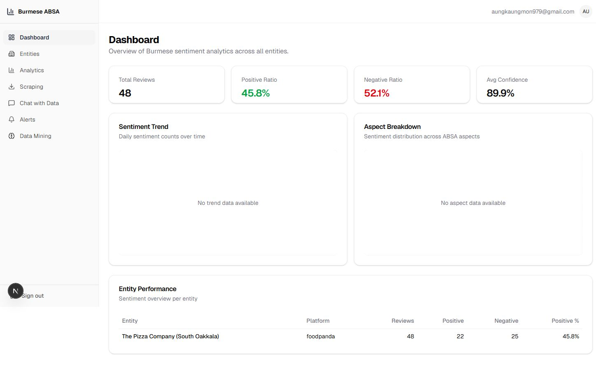

---

### ISSUE-002: Opening an entity always ends at “Failed to fetch”

| Field | Value |
|-------|-------|
| **Severity** | critical |
| **Category** | functional / ux |
| **URL** | http://localhost:3000/entities/1 |
| **Repro Video** | N/A — authenticated Chrome control did not expose video capture; step screenshots included |

**Description**

The entity list loads correctly, but selecting the only populated entity navigates to `/entities/1`, briefly renders empty metric/review shells, and then replaces the entire detail area with the raw message “Failed to fetch.” The browser trace records two identical requests to `/api/analytics/entities/1`; both end in `net::ERR_FAILED`. This blocks the complete entity-detail workflow, including aspect sentiment and recent reviews.

**Expected**

The selected entity’s metrics, aspect distribution, and recent reviews should load. On recoverable failure, the page should retain context and offer retry/navigation guidance.

**Repro Steps**

1. Open **Entities**, choose **Foodpanda**, and locate “The Pizza Company (South Oakkala).”

   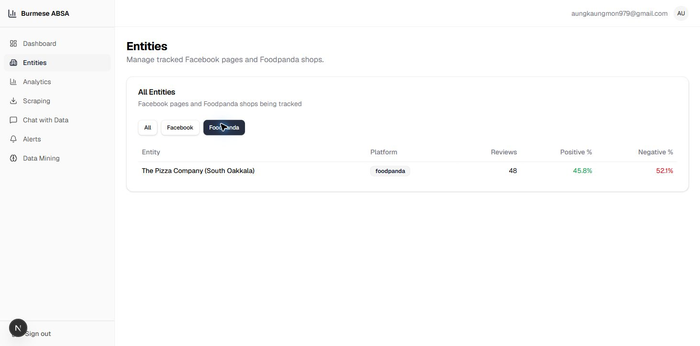

2. Select the entity and wait for the detail request to complete.
3. Observe the full-page “Failed to fetch” state.

   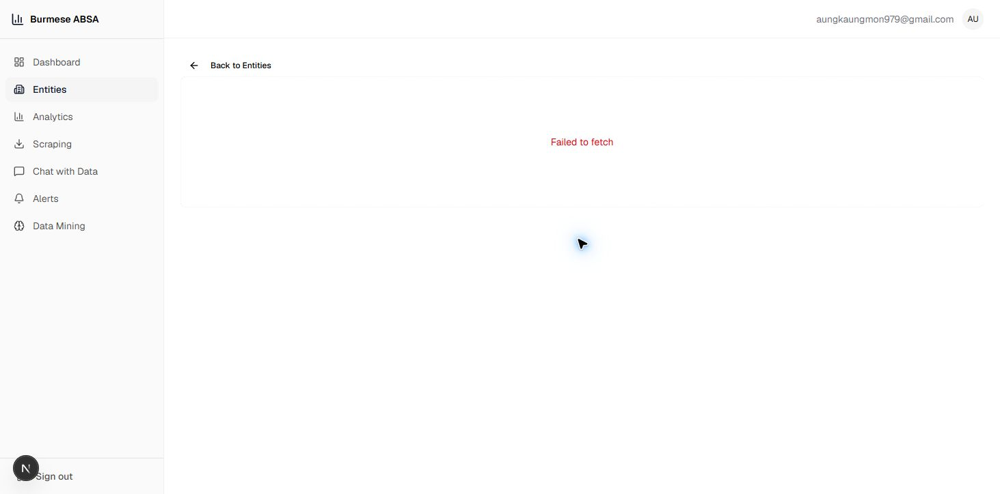

---

### ISSUE-003: Analytics charts are rendered too small to read

| Field | Value |
|-------|-------|
| **Severity** | medium |
| **Category** | visual / ux |
| **URL** | http://localhost:3000/analytics |
| **Repro Video** | N/A — visible on load |

**Description**

The Facebook Engagement and Entity Comparison cards reserve hundreds of pixels of height, but their actual charts occupy only a small patch of the available canvas. Axis labels and the radar geometry are effectively unreadable at the tested desktop viewport, while most of each card is empty whitespace.

**Expected**

Charts should expand to the responsive container, preserve readable labels, and use the available card area.

**Repro Steps**

1. Open **Analytics** at the normal desktop viewport.
2. Scroll to **Facebook Engagement** and **Entity Comparison**.
3. Observe the tiny plots inside otherwise large cards.

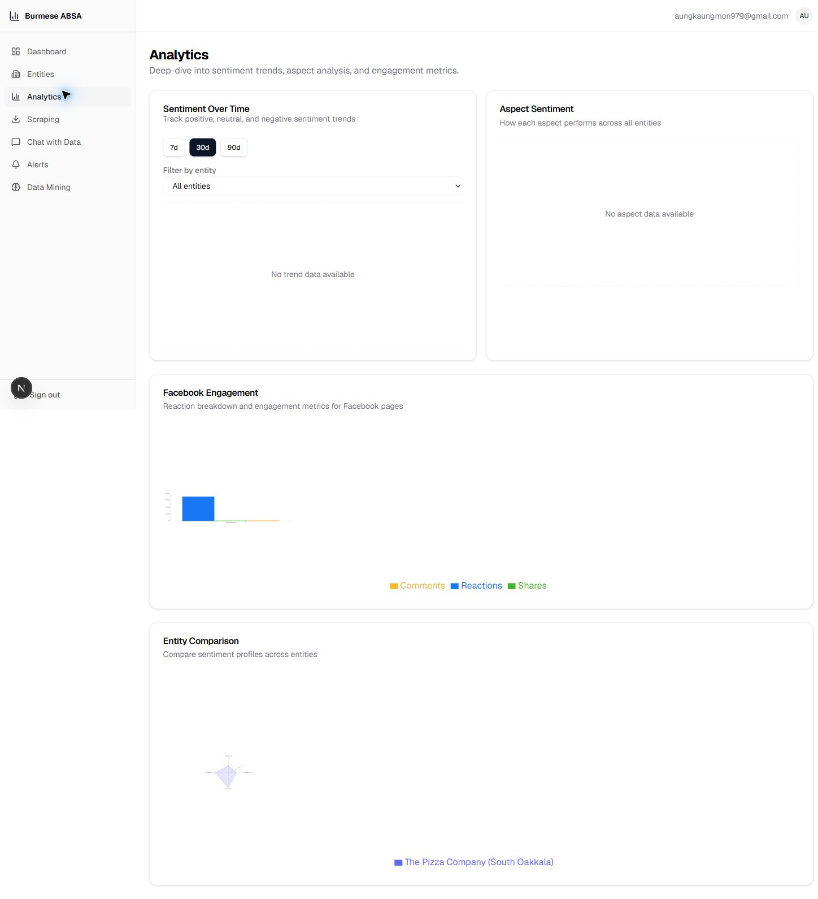

---

### ISSUE-004: “Chat with Data” is a nonfunctional production route

| Field | Value |
|-------|-------|
| **Severity** | high |
| **Category** | functional / content / ux |
| **URL** | http://localhost:3000/chat |
| **Repro Video** | N/A — authenticated Chrome control did not expose video capture; step screenshots included |

**Description**

The page exposes internal implementation instructions (`TODO(Member 5)`, API paths, and expected response UI) directly to end users. Entering a valid question and clicking the enabled send button causes no visual state change and produces no network request. The query remains in the textbox and no result, progress indicator, or error appears.

**Expected**

The route should send the query and show loading, response, or actionable error states. Incomplete features should be hidden or clearly presented as unavailable without leaking developer notes.

**Repro Steps**

1. Open **Chat with Data** and enter “Which entity has the most negative reviews?”

   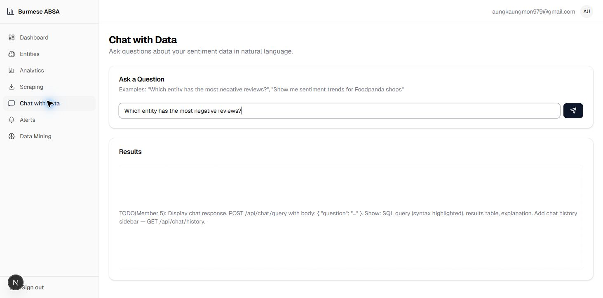

2. Click the enabled send icon.
3. Observe that nothing changes and no request is issued.

   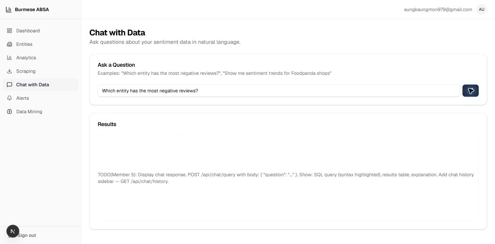

---

### ISSUE-005: Data Mining exposes developer TODO placeholders

| Field | Value |
|-------|-------|
| **Severity** | high |
| **Category** | functional / content |
| **URL** | http://localhost:3000/mining |
| **Repro Video** | N/A — visible on load |

**Description**

The Data Mining sidebar destination displays internal assignment notes for “Member 3.” The route looks like an available product feature in navigation but contains no usable functionality.

**Expected**

Implement the routes, remove them from production navigation, or replace them with an intentional “Coming soon” state that does not expose internal development instructions.

**Repro Steps**

1. Select **Data Mining** and observe the raw TODO implementation state.

   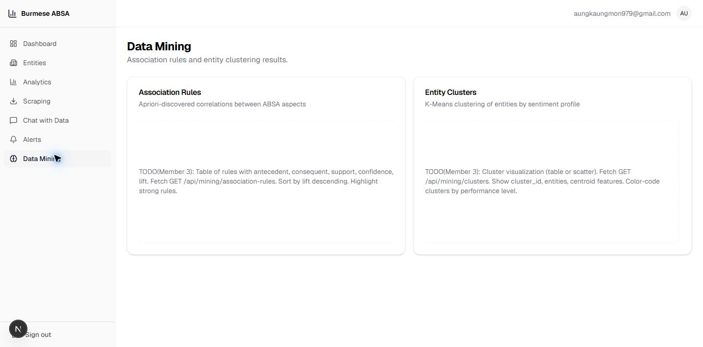

---

### ISSUE-006: Icon-only controls have no accessible names

| Field | Value |
|-------|-------|
| **Severity** | medium |
| **Category** | accessibility |
| **URL** | http://localhost:3000/chat and mobile authenticated routes |
| **Repro Video** | N/A — structural accessibility issue |

**Description**

The Chat submit control is exposed only as an unnamed `button`, so assistive technology cannot identify its purpose. The responsive hamburger control is also exposed as an unnamed `button`. Both are core controls, not decorative elements.

**Expected**

Each icon-only control should have a stable accessible name such as `Send question` or `Open navigation`, and the mobile menu control should expose expanded/collapsed state.

**Evidence**

- Chat accessibility tree: `button` with no name beside the question textbox.
- Mobile header accessibility tree: `button` with no name.
- Visual chat evidence: [issue-004-result.png](screenshots/issue-004-result.png)
- Visual mobile-menu evidence: [mobile-menu-open.png](screenshots/mobile-menu-open.png)

---

### ISSUE-007: Mobile layout exceeds the viewport and clips content

| Field | Value |
|-------|-------|
| **Severity** | high |
| **Category** | responsive / visual / ux |
| **URL** | http://localhost:3000/dashboard |
| **Repro Video** | N/A — visible at the responsive breakpoint |

**Description**

At a 390 px viewport, the authenticated header and main content measure 541 px wide. The document reports no usable horizontal scroll area, so the extra 151 px is clipped. The dashboard subtitle, account identity, cards, and wide entity table extend beyond the visible viewport.

**Expected**

Authenticated pages should fit the viewport, wrap or truncate header content intentionally, and provide a mobile table treatment without inaccessible off-screen columns.

**Repro Steps**

1. Set the viewport to 390 × 844 and open the dashboard.
2. Observe clipped right-side content in the actual 390 px viewport.
3. Open the mobile menu; navigation works, but the underlying page remains oversized.

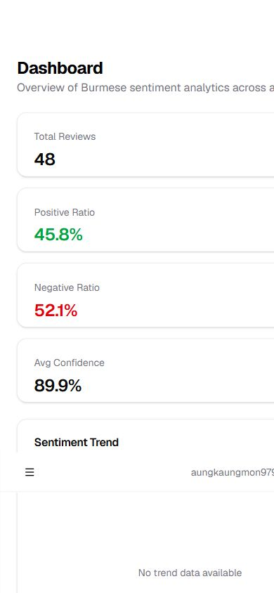

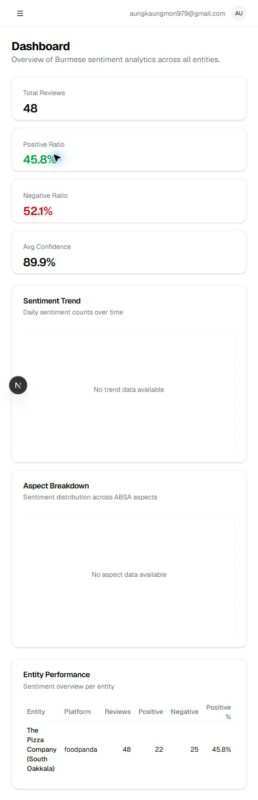

---

### ISSUE-008: Login page lacks basic document landmarks and an H1

| Field | Value |
|-------|-------|
| **Severity** | medium |
| **Category** | accessibility |
| **URL** | http://localhost:3000/login |
| **Repro Video** | N/A — automated accessibility finding |

**Description**

An axe-core 4.12.1 audit reports three moderate violations: the document has no `main` landmark, no level-one heading, and four content regions are outside landmarks. The visible page title is an H3.

**Expected**

Wrap the authentication card in a `main` landmark, promote the page title to an H1, and ensure all primary page content is contained in landmarks.

**Repro Steps**

1. Open `/dashboard` in a clean unauthenticated browser and verify the redirect to `/login`.
2. Run the default axe audit.
3. Observe `landmark-one-main`, `page-has-heading-one`, and `region`.

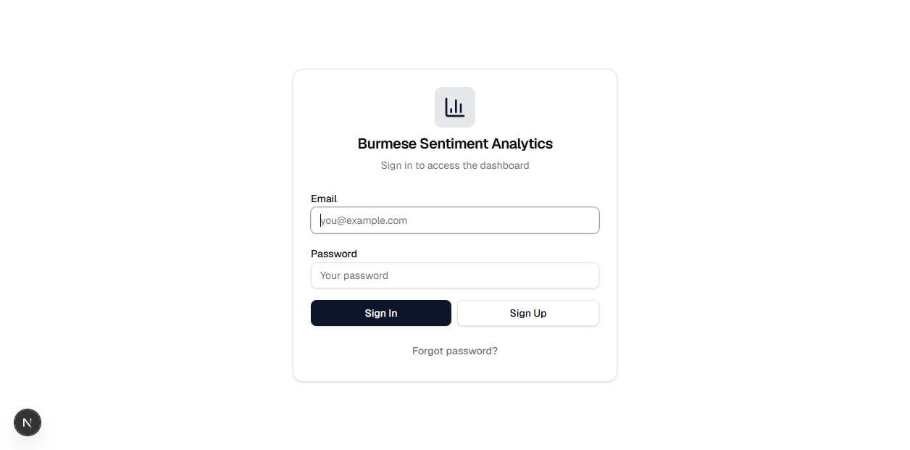

---

### ISSUE-009: Cookie status claims an expiration but omits the date

| Field | Value |
|-------|-------|
| **Severity** | low |
| **Category** | content / ux |
| **URL** | http://localhost:3000/scraping |
| **Repro Video** | N/A — visible on load |

**Description**

The Facebook cookie badge reads “Valid — expires” with no date or relative time. The status appears authoritative but gives no usable expiration information, which makes it difficult to know when scraping credentials need renewal.

**Expected**

Show a formatted expiration timestamp/relative duration, or omit the word “expires” when no expiration value is available.

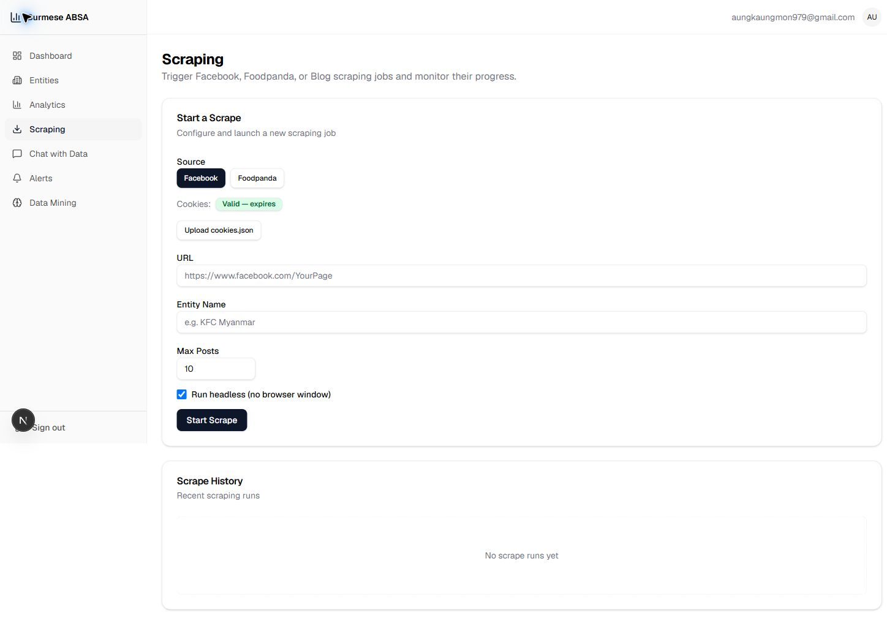

---
